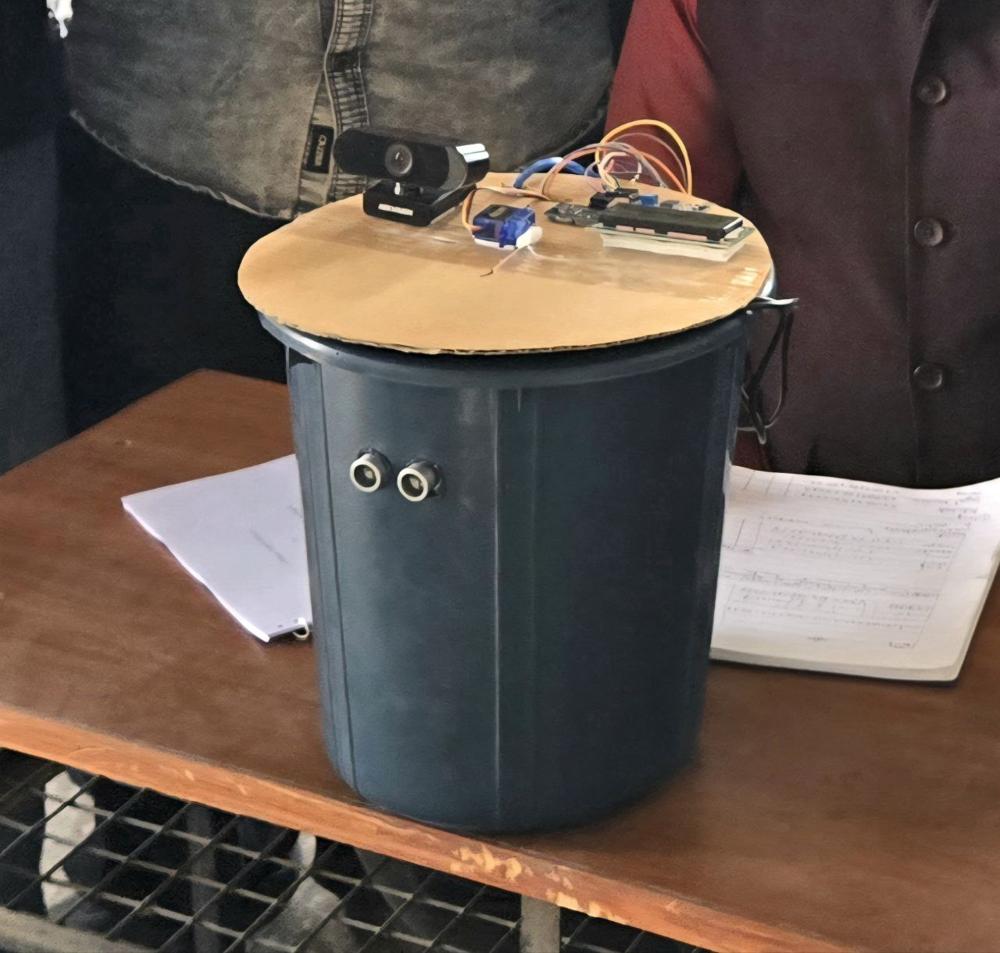

<h1 align="center">♻️ EcoBin</h1>

<b>AI-Powered Smart Waste Segregation & Monitoring System</b> 
IoT • AI • Real-Time Dashboard • Smart Cities

  
  
  
  

---

## 🚀 Overview
EcoBin is an **end-to-end smart waste management system** developed as part of **Smart India Hackathon (SIH)**.  
It automates waste segregation and real-time bin monitoring using **IoT sensors, AI-based waste classification, and a cloud-connected dashboard**.

The system detects waste disposal events, tracks bin fill levels live, classifies waste into **Dry/Wet categories using AI**, and visualizes actionable insights for authorities. EcoBin is designed for **smart campuses and smart cities** with scalability in mind.

---

## 🎯 Problem Statement
Traditional waste management suffers from:
- ❌ Manual segregation  
- ❌ Overflowing bins  
- ❌ Inefficient collection schedules  
- ❌ No real-time visibility  

EcoBin solves this by enabling **automated segregation, live monitoring, and data-driven waste collection**.

---

## ✨ Key Features
- 🤖 AI-based waste classification (Dry / Wet)
- 📡 Real-time bin fill level monitoring
- 📊 Live dashboard with analytics
- 🗺️ Bin location mapping
- ⏱️ Fill trend & time-to-full prediction
- 🚨 Alerts for near-full bins
- 🌍 Smart-city ready architecture

---

## 🧠 System Architecture
Waste Sensors  
↓  
ESP32  
↓  
Firebase Realtime Database  
↓  
Web Dashboard  
↑  
AI Waste Classifier (TensorFlow.js)

---
## 🔧 Hardware Components
- ESP32 (WiFi-enabled microcontroller)
- IR Sensor (waste detection)
- LCD Display (local bin status)
- Power Supply & Bin enclosure

---

## 🤖 AI / ML Module
- Trained using **Google Teachable Machine**
- Implemented with **TensorFlow.js**
- Performs real-time waste classification
- Outputs waste type with confidence score
- Logs predictions directly to Firebase

---

## 🌐 Web Dashboard Features
- 📈 Live fill level indicator
- 🕒 Activity log with timestamps
- 📊 Line chart for fill trends
- 🥗 Waste distribution pie chart
- 🔋 Bin health & collection status
- 🌱 Carbon footprint estimation
- ⏳ Time-to-full prediction

---

## ☁️ Cloud & Backend
- **Firebase Realtime Database**
- REST-based data communication
- Structured data model for scalability

---

## 🛠️ Tech Stack

### Hardware
- ESP32
- IR Sensor
- LCD Display

### Software
- HTML, CSS, JavaScript
- Chart.js
- Firebase Realtime Database
- TensorFlow.js
- Teachable Machine

## 📸 Screenshots
_Add dashboard and system images here._
|  |
|  |

---

## 🌍 Applications
- Smart Cities
- Smart Campuses
- Public Waste Management
- Recycling Facilities

---

## 🚀 Future Enhancements
- Multi-class waste detection
- Automated sorting mechanism
- GPS-enabled bin tracking
- Mobile app notifications
- Multi-bin fleet management

---

## 👤 Author
   **Shlok Rajput**  

> Built with a focus on real-time systems, clean architecture, and real-world impact.
